# AgileROHFinder and AgileROHFilterer
Command line applications for the detection of autozygous regions from Exome or Affymetrix microarray SNP data.

## Data format
AgileROHFinder identifies autozygous regions using genotype data formatted as either VCF files or Affymetrix genotype files (or older xls or birdseed) text files. Similarly, AgileROHFilterer will process a VCF file (but not microarray  genotype data), creating a second VCF that only contains variants within the autozygous regions. The format and required fields of the VCF and microarray input files is described [here](DataFormat.md).

#### <font color="red">Note:</font> 
> These programs will process a specified sample in a VCF file containing multiple samples, but will only process the last sample in Affymetrix genotype data files. 


## Creating the programs

The source code can be compiled on both Linux and Windows computers as described [here](BuildingThePrograms.md).

## Precompiled programs

Both programs have been precompiled for Linux and Windows and placed in the Program folder. Select the appropriate OS and download the programs ([Linux](Program/Linux) or [Windows](Program/Windows)). Due to the security policies of some organisations, downloading programs on a Windows computer may not be straight forward, however this [guide](Program/README.md) may help. Due to variations in the set up of Linux systems the Linux programs may not work and so may need to be compiled from the source code. 

## Running the programs
These programs are console applications and so do not have a user interface. They run within a terminal environment. On Linux this will typically be in a bash terminal while on windows it will be a "Command Prompt" or "PowerShell" terminal. If the analysis is preformed on a remote server the application would typically be run from the inbuilt bash terminal on Linux or Mac or on windows via a third party terminal such as Putty. In both cases they connect to the remote server via an SSH connection.

The examples below use the Linux file structure were /data/in.vcf refers to a file in the "data" folder, the equivalent on Windows would be "C:\data\in.vcf".

### Helpful scripts
The [Program > scripts](Program/scripts/README.md) page contains a python and bash scripts that may be helpful.

#### Commands
Both programs require similar commands, the structure of the commands (without optional parameters) to run ```AgileROHFinder``` and ```AgileROHFilterer``` are shown below and described in greater detail in the table.

```AgileROHFinder``` 
> /path/AgileROHFinder.exe /data/in.vcf /data/out.txt -t 

```AgileROHFilterer```  

> /path/AgileROHFilterer.exe /data/in.vcf /data/out.vcf /data/out.txt 500000 -t

#### Note

> If a folder or file name contains a space the file name and its location must be placed in speech marks i.e /my data/my file.vcf should be entered as "/my data/my file.vcf"

#### Table 1: Description of command parameters and options
|Command fragment|Description|Note|
|-|-|-|
|/path/AgileROHFinder.exe or <br />/path/AgileROHFilterer.exe|Name of the program with it's location||  
|/data/in.vcf|The name (with location) of the data file to process.| ```AgileROHFilterer``` will only process vcf files while ```AgileROHFinder``` will process vcf files and Affymetrix microarray genotype files|
|/data/out.vcf<br />(```AgileROHFilterer``` only)|Name of a file to save the filtered variant data too. | ***Note*** This option is only present in ```AgileROHFilterer```<br /> While it will create this file, it will not create any directories, so the path to the location most exist before the program is run.|
|/data/out.txt|The name with location of the file to save the list of autozygous regions too|While they will create this file, they will not create any directories, so the path to the location most exist before the program is run.|
|Any whole positive number<br />(```AgileROHFilterer``` only)|The reported regions are be extended by this number of bases when ```AgileROHFilterer``` filters the variants by position, such that variants just outside a region are also retained| ***Note*** This option is only present in ```AgileROHFilterer```|
|Export format options <br />__-t__, __-b__ or __-a__|Sets the format of the data results file|See Tables 2 to 4 for examples|
|Process all variants: __-Y__ |By default only variants with an RS ID are processed, if __-Y__ is set then all SNPs (with one alternative allele) will be used|**Optional**: only affects analysis of VCF data| 
|Use genotypes in VCF file: __-V__|By default a variant's genotype is calculated by the program, if __-V__ is setused, the genotype in the VCF file is used (The file most have the 'GT' field)|**Optional**: only affects analysis of VCF data| 
|Select sample to be process in multi-sample VCF file: any whole positive number|If a VCF file has multiple samples this optional parameter sets which sample is analysed.|**Optional**: only affects analysis of VCF data|  
 
 Table 2

|Autozygous regions output file format: Option __-t__ (columns separated by tab character)|
|-|
|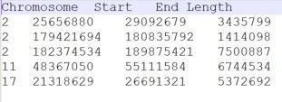|

 Table 3
 
 |Autozygous regions output file format: Option __-b__ (Each line can be entered in to the UCSC genome browser)|
|-|
|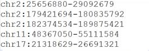|

 Table 4
 
 |Autozygous regions output file format: Option __-a__ (Contains both formats)|
|-|
|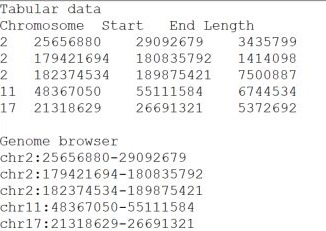|


## Feedback
As the programs run, the current status will be shown in the terminal window.  

### A successful analysis:

Figure 1: ```AgileROHFiinder```

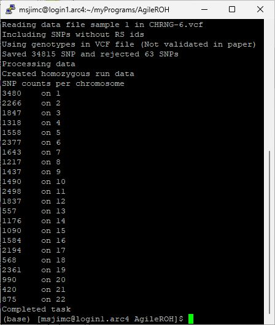 

Figure 2: ```AgileROHFilterer```

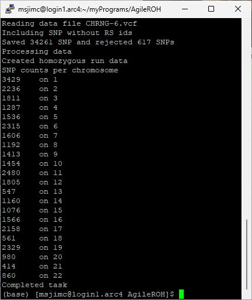

Figure 1

Figures 1 and 2 show a typical status report of the analysis of a exome vcf file by ```AgileROHFinder``` and ```AgileROHFilterer``` respectively where only variants with an RS id were used and their genotypes were calculated by the programs.   

#### Output description:
* Initially, the program states which file is being process along with the sample's index (VCF files only).  
* Next it states whether it will process variants without an RS ID. "*Including SNPs without RS ids*" indicates it will process all variants,  while *"Ignoring SNPs without RS IDs*" indicates unnamed variants will be excluded.  
* The program then declares whether it is calculating the genotypes from the allele read depths (Calculating genotypes) or using those in the VCF file (Using genotypes in VCF file (Not validated in paper)): Using genotypes in the VCF file was not validated in the linked paper.
* Once the file has been read, the program displays the number of SNPs saved and the number rejected. Only single base SNPs on the autosomal chromosomes are counted with the main reasons for a variant been rejected are low total read count or skewed allele read ratios. <br />(Issues with the file format may also cause the SNPs to be rejected, in this case an excessive number or all the SNPs may be rejected.)   
* Next the program states that it is analysing the SNP data to find autozygous regions ("*Processing data and finding autozygous regions*") followed by "*Created homozygous run data*" when the analysis is completed.  
* The next 23 lines form a table of the number of SNPs analysed on each autosomal chromosome. Typically, the number of variants depends on the length of the chromosome and for exome data the number of genes on the chromosome.
* Finally, ```AgileROHFilterer``` will state "*Filtering the VCF file*" indicating it is creating the results files. Since ```AgileROHFinder``` does not filter the variants, it just states "*Completed task*".

### Unexpected results
Both ```AgileROHFilterer``` and ```AgileROHFinder``` will try to process the arguments as best as possible and may not always detect an error. If the results are unexpected, check the messages described above to see if the command line has been written and processed correctly.

## Failed analysis

### Error in command line structure
Both ```AgileROHFilterer``` and ```AgileROHFinder``` will try to process the arguments as best as possible and may not always detect an error. A significant error that neither program will detect is the use of a data filename as an export filename, in which case the data file will be overwritten. Figure 3 shows the output from ```AgileROHFilterer``` if the 'n' value (number of bases by which a region is extended) is omitted or the arguments are in the wrong order. This message is very similar to the message displaced if the command line contains too few or too many arguments.

|Figure 3: Wrong input file|
|-|
|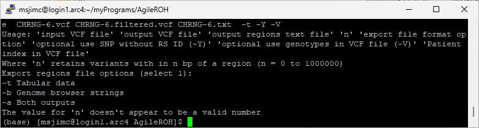 |


### Wrong input file name

|Figure 4: Wrong input file|
|-|
|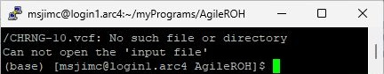 |

Figure 4: Feedback if the input file is incorrectly entered. A similar message will be displayed if the program can not open the file because it is open for editing in another program or you don't have permission to write to the file.

### Trying to export data to a folder that doesn't exist

|Figure 5: Folder does not exist
|-|
|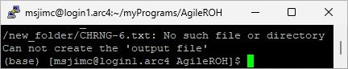 |

Figure 5: Feedback if the folder the export file is to be saved in does not exist. The programs can create results files, but will not create folders/directories.

### File locked by another program or you don't have the necessary permissions
The error messages in Figures 4 and 5 may also be generated if you don't have permission to read/write to the files or folders. Similarly, if a file is open for editing in another program, access to it may be blocked resulting in a similar message.

### The input data file's extension is not recognised

|Figure 6: Unrecongised file extension
|-|
|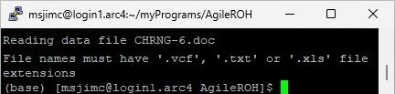 |

Figure 6: Feedback if the program does not recognise the file extension. While Linux itself does not use file extensions, these programs do use them to decide what type of data file is being used. If the file extension is not '.vcf', '.txt' or '.xls' the program will not process them. 

### The input data file's extension does not match the data type

|Figure 7: Wrong file extension
|-|
|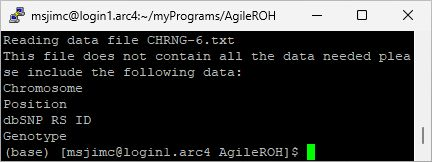 |

Figure 7: Feedback if the input file's extension does not match it's format. In this case the file is a vcf file, but its extension has been changed to txt. Consequently, the program tries to processed it as a microarray file and found that it does not contain the expected data fields/columns.

### The input data file does not contain all the required data fields/columns

|Figure 8: Missing data fields
|-|
|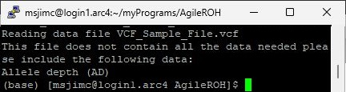 |

Figure 8 shows the feedback if the input file does not contain the expected data fields/columns. In this case the vcf file is being processed without the '-V' option and while the file contains the total read depth value for each variant, it does not contain the read depths for each allele. 

### Sample index to high (VCF files only)

|Figure 9: Missing data fields
|-|
|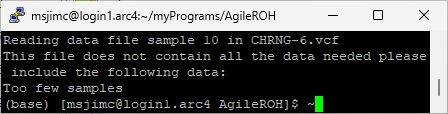 |

If a VCF file contains multiple samples it is possible to select which sample is processed by adding the samples index to the command line arguments. If the value is less than 1 it is ignored, if it is greater than the number of samples in the file the error message in Figure 9 is displayed.

### The input data file's format is completely wrong

|Figure 10: Wrong totally file format
|-|
|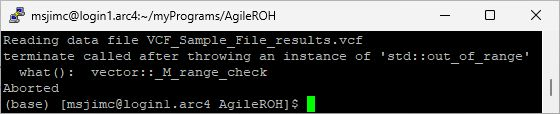 |

Figure 10: Feedback if the input file format is totally wrong and the program crashes reading it. In this case a results text file was given a vcf file extension and then entered as a vcf data file. The program has attempted to read data that does not exist and crashed. This will create a cryptic error message, if the problem persists after checking the files format, you may need to contact me. 

### Note

There are many ways in which the input data or command line arguments lead the analysis to fail. While the commonest reasons have been listed above its possible that some combinations of input data format and command options will result in unexpected behaviour. In these cases always check that the file format matches the expected format as listed on the [data format page](DataFormat.md).

## Identifying regions in VCF files without read depth data
While many VCF files include read depth data for each variant, some VCF files do not. To allow the processing of this data, it is possible to instruct the programs to ignore read depth data and use the genotypes in the VCF file. In these cases the VCF file must contain the '__GT__' field and have have the genotypes declared as 0/0, 0/1, 1/0 or 1/1. Figure 11 shows the feedback of the analysis by ```AgileROHFinder``` with the optional __-V__ used to set this behaviour.

|Figure 11: Use of genotypes in VCF file
|-|
|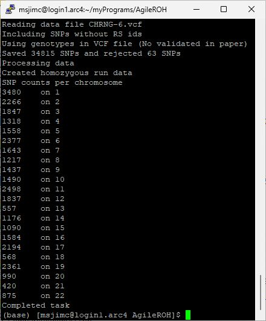 |

***Important note***: The results from this type of analysis were not investigated in the paper and so it is not supported. The quality of the results is highly likely to be dependant on the variant calling software and parameters used in its operation. 