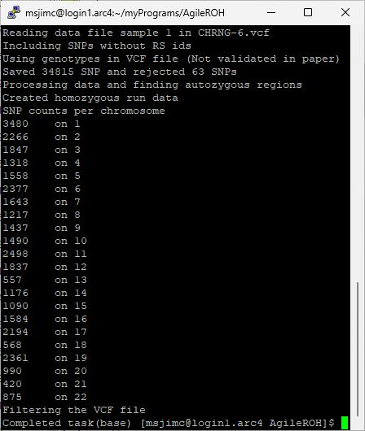

# AgileROHFinder and AgileROHFilterer
Command line applications for the detection of autozygous regions from Exome or Affymetrix microarray SNP data.

## Data format
AgileROHFinder can process data formatted as VCF file as well as older Affymetrix xls and birdseed files with the required fields/columns described [here](DataFormat.md). Similarly, AgileROHFilterer will process a VCF file (but not microArray genotype data), creating a second VCF that only contains variants within the autozygous regions.

#### Note: 
> These programs will only analyse one patient per file, if a file contains data on multiple individuals only one person will be analysed. 


## Creating the programs

The source code can be compiled on both Linux and Windows computers as described [here](BuildingThePrograms.md).

## Prebuild programs

Both programs have been prebuilt for Linux and Windows and placed in the Program folder. Select the appropriate OS version and download the programs ([Linux](Program/Linux) or [Windows](Program/LiWindowsnux)). Due to the security policies of some organisations, downloading programs on a Windows computer may not be straight forward, however this [guide](Program/README.md) may help.  

## Running the programs
These programs are console applications and so do not have a user interface and run within a terminal environment. On Linux this will typically be in a bash terminal while on windows it will be a "Command Prompt" or "PowerShell" terminal. If the analysis is preformed on a remote server the application would typically be run from the inbuilt bash terminal on Linux or Mac and from a third party terminal such as Putty on windows 

The examples below use the Linux file structure were /data/in.vcf refers to a file in the "data" folder, the equivalent on Windows would be "C:\data\in.vcf".

#### Commands
Both programs require very similar commands, with ```AgileROHFilterer``` requiring the name of a vcf file to save the filtered variants too. The structure of the commands to run ```AgileROHFinder``` and ```AgileROHFilterer```  are shown below:

> /path/AgileROHFinder.exe /data/in.vcf /data/out.txt -t

> /path/AgileROHFilterer.exe /data/in.vcf /data/out.vcf /data/out.txt 500000 -t

|Command section|Description|Note|
|-|-|-|
|/path/AgileROHFinder.exe or <br />/path/AgileROHFilterer.exe|Name of the program with it's location||  
|/data/in.vcf|The name (with location) of the data file to process.| ```AgileROHFilterer``` will only process vcf files while ```AgileROHFinder``` will process vcf files and Affymetrix microarray genotype files|
|/data/out.vcf|Name of a file to save the filtered variant data too.<br />This option is only present in ```AgileROHFilterer```| While it will create this file, it will not create any directories, so the path to the location most exist before the program is run.|
|/data/out.txt|The name with location of the file to save the list of autozygous regions too|While it will create this file, it will not create any directories, so the path to the location most exist before the program is run.|
|Any whole positive number|The reported regions are be extended by this number of bases when ```AgileROHFilterer``` filters the variants by position, such that variants just outside a region are also retain| This option is only present in ```AgileROHFilterer```|
|Export format options __-t__, __-b__ or __-a__|Sets the format of the data results file|See below for examples|
|Process all variants: __-Y__ or __-N__|By default only variants with an RS ID are processed, if __-Y__ is set then all SNPs (with one alternative allele) will be used|Optional|  
 


## Feedback
As the programs run, they will report their current status to the in the terminal window.  

### A successful analysis:

Figure 1: ```AgileROHFilterer```

 

Figure 2: ```AgileROHFinder```



Figure 1

Figures 1 and 2 show a typical status report from the analysis of a exome vcf file by ```AgileROHFilterer``` and ```AgileROHFinder``` respectively.   
Initially, the program displays which file is being process.  
Next it states whether it will process variants without an RS ID. "*Including SNP without RS ids*" indicates it will process all variants,  while *"Ignoring SNPs without RS IDs*" indicates unnamed variants will be excluded.  
Once the file has been read, the program displays the number of SNPs saved and the number rejected. Only single base SNPs on the autosomal chromosomes are counted with the main reasons a variant is rejected is either a low total read count or skewed allele read ratios.   
Next the program declares that it is analysing the SNP data to find autozygous regions ("*Processing data and finding autozygous regions*") followed by "*Created homozygous run data*" when the analysis is completed.  
The next 23 lines form a table of the number of SNPs analysed on each autosomal chromosome. Typically, the number of variants depends on the length of the chromosome and the number of genes it contains that are in the pulldown reagent.
Finally, ```AgileROHFilterer``` will state "*Filtering the VCF file*" indicating it is creating the results files. Since ```AgileROHFinder``` does not filter the variants, it just states "*Completed task*".

### Incorrectly named input file

|Figure 3: Wrong input file|
|-|
| |

Figure 3 shows the program feedback if the input file is incorrectly entered. A similar message will be displayed if the program can not open it because it is open for editing in another program.

### Trying to export data to a folder that doesn't exist

|Figure 4: Folder does not exist
|-|
| |

Figure 4 shows the program feedback if the folder the export file is to be saved too does not exist. The programs can create results files, but will not create folders/directories.

### The input data file's extension is not recognised

|Figure 5: Unrecongised file extension
|-|
| |

Figure 5 shows the program feedback if input file does not recognise the file extension. While Linux itself does not use file extensions, these programs do use them to decide what type of data file is been used. If the file extension is not '.vcf', '.txt' or '.xls' the program will not process them. 

### The input data file's extension does not match the data type

|Figure 6: Wrong file extension
|-|
| |

Figure 6 shows the program feedback if input file's extension does not match it's format. In this case the file is a vcf file, but its extension has been changed to txt. Consequently, the program has processed it as a microarray file and found that it does not contain the expected data fields/columns.

### The input data file does not contain all the required data fields/columns

|Figure 7: Missing data fields
|-|
| |

Figure 7 shows the program feedback if input file does not contain the expected data fields/columns. In this case the vcf file contains the total read depth value for each variant, but not the read depths for each allele. 